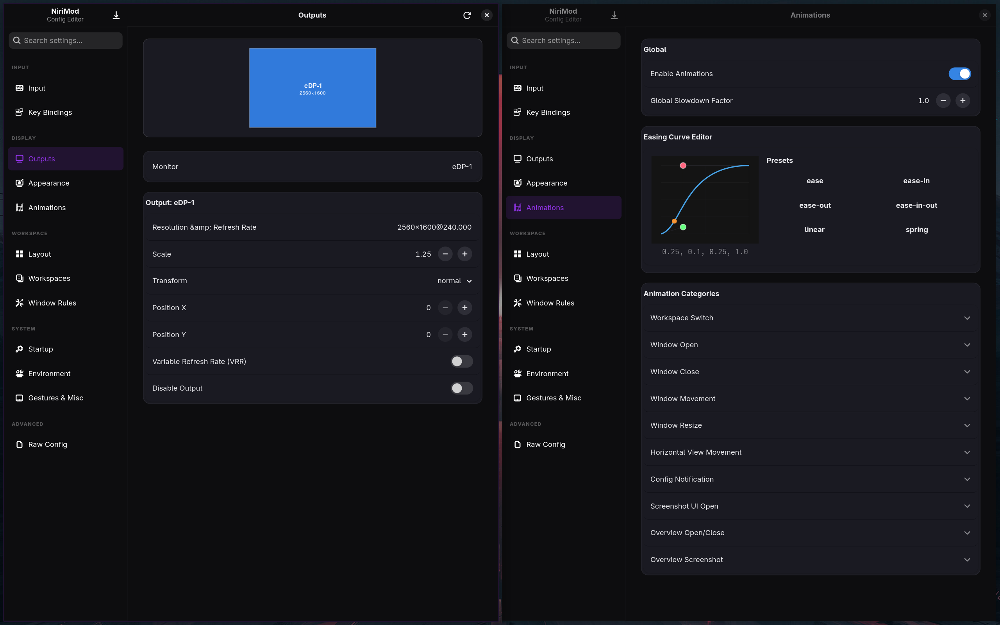
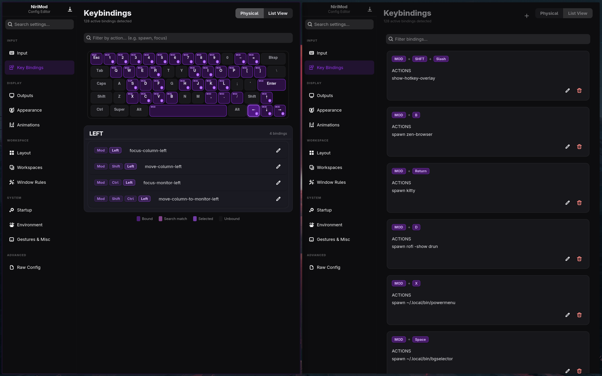

<div align="center">
  <h1>NiriMod</h1>
  
  **A polished, native GTK4/libadwaita companion for the [niri](https://github.com/niri-wm/niri) Wayland compositor.**

  [](LICENSE)
  [](https://python.org)
  [](https://gtk.org)
  [](https://wayland.freedesktop.org)
</div>

<br>



NiriMod transforms the way you interact with your window manager. It provides a visual, safe, and intuitive interface for deep configuration, eliminating the need to hand-edit KDL files and endure endless "save and reload" cycles.

---

## 📸 Interface & Capabilities

### Monitor Logic and Motion

This is where you handle the "physical" feel of the desktop. On the left, the **Outputs** section makes it easy to deal with display scaling and resolution—no more guessing monitor names or writing out KDL lines just to fix a blurry screen. 

On the right, the **Animations** tab replaces the trial-and-error of editing cubic-bezier values. You can actually see the curve you're creating, so your windows move exactly how you want them to without a dozen "save and reload" cycles.

*(Note: The hero screenshot at the top demonstrates this side-by-side interface!)*

---

### Keybinding Management

Keeping track of a hundred shortcuts is a headache, so this view splits them into two logical parts. 

The **Physical map** is a visual check for your muscle memory; it highlights which keys are actually in use so you don't accidentally overlap bindings. Next to it, the **List view** is a clean, searchable registry. It’s for when you know what you want to do—like launching a browser or terminal—and you just need a quick way to assign or change the trigger without hunting through a giant config file.



---

## 🎬 See it in Action

> Watch a demonstration of NiriMod—from launch, through configuration, to saving a validated config back to disk.

https://github.com/user-attachments/assets/demo.mp4

> *(Download [`demo.mp4`](media/demo.mp4) if the inline player doesn't load.)*

---

## 🛡 Built-In Safety & Stability

- **Zero-Risk Saving:** Every change is automatically validated against the `niri validate` engine before it touches your disk. If it's not a valid config, NiriMod won't save it.
- **Unlimited Undo/Redo:** Experiment freely. Revert any change instantly with `Ctrl+Z`.
- **Profiles:** Create and switch between named configuration profiles (e.g., "Deep Work", "Gaming", or "Presentation") in seconds.
- **Raw Mode:** A built-in code editor for those moments when you want to dive into the manual KDL configuration with full syntax highlighting.

---

## 🚀 Installation

The simplest way to install NiriMod and all its dependencies is through the interactive installer.

```bash
# One-line interactive install
curl -sSL https://raw.githubusercontent.com/srinivasr/nirimod/main/install.sh | bash
```

### Advanced Installation Options

| Flag | Purpose |
| :--- | :--- |
| `--install` | Direct non-interactive installation from GitHub. |
| `--local` | Install from the current directory (perfect for developers). |
| `--uninstall` | Clean removal of NiriMod and its artifacts. |

---

## 🏗 Requirements

NiriMod is designed for modern Linux systems and supports all major distributions (Arch, Fedora, openSUSE, Debian/Ubuntu).

| Dependency | Notes |
| :--- | :--- |
| **Python 3.12+** | Core runtime |
| **GTK4 + libadwaita** | Native UI toolkit |
| **PyGObject** | Python GTK bindings |
| **[uv](https://github.com/astral-sh/uv)** | Virtual environment manager — automatically handled by the installer |
| **niri** | The Wayland compositor this tool configures |

---

## 💡 Inspiration

NiriMod was inspired by [**Hyprmod**](https://github.com/BlueManCZ/hyprmod), an excellent configuration manager for the Hyprland compositor.

---

*NiriMod is an independent open-source project and is not affiliated with the core niri development team.*
